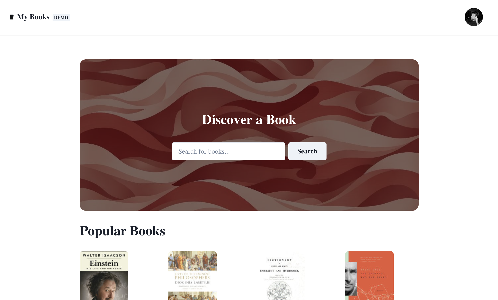
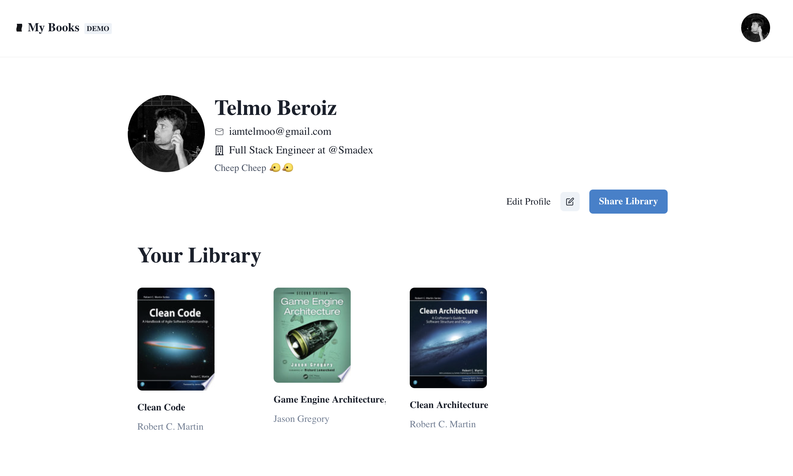
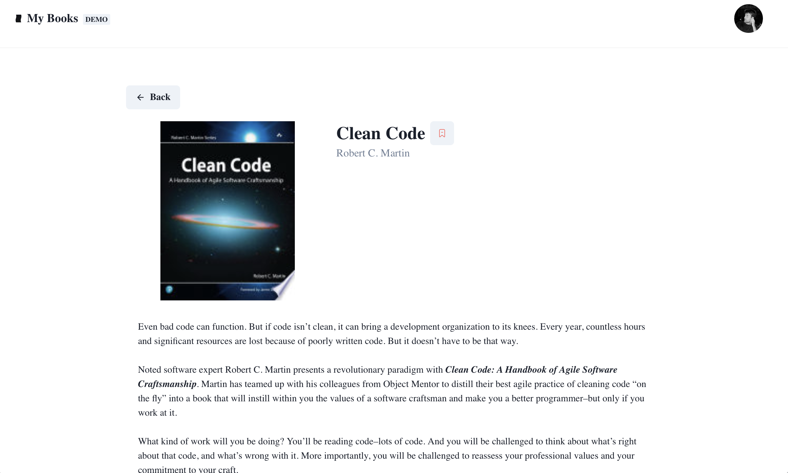

# MyBooks

Welcome to My books! My books was an attempt in my initial days in web development to attend into Bending Spoon's First Ascent event. I was starting my path into web development and I wanted to learn oauth concepts and api endpoints creation and usage, so I did this project. 

It is a simple website where you can save books you most like into your library, and be able to share it with others.

Sharing my profile here! https://my-books-mu.vercel.app/public/103346694496266430204

## Features
- Create and manage personal book portfolios
- Share reading lists with other professionals
- Professional profile showcasing your reading interests
- Integration with external book APIs

## Technologies Used
- **Frontend**: Next.js, React, Chakra UI
- **Authentication**: Google OAuth
- **Book Data**: Google Books API
- **Database**: Hygraph (GraphQL)
- **Deployment**: Vercel

## Screenshots
### Home Page

### Library View

### Book Details

